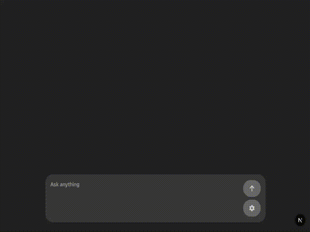
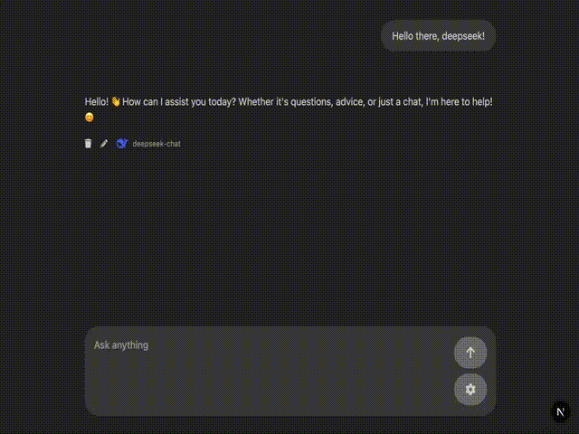

# nextjs-llm-integration



This is a demo repo for a client-side chat app that allows using different providers/models for the LLM.

The app currently supports the following providers/models:

- anthropic:claude-3-5-haiku-20241022
- deepseek:deepseek-chat
- openai:gpt-4o

---

# ⚠️ This repo is not meant to be used in a production environment in its current state. ⚠️

## Requirements

- Node v22.x
- yarn v4.9.2

## Installation

Note: No .env is necessary. Keys are handled under Settings in the browser.

`yarn install` to install dependencies.

## Scripts

```bash
yarn dev # Start local dev server
yarn build # Build for production
yarn start # Start production server
yarn lint # Run ESLint
yarn type-check # Run TypeScript type checker
```

## Running the App

Run `yarn dev`

Open [http://localhost:3000](http://localhost:3000) with your browser to see the result.

## Settings



- Once the app is running, open it in the browser and click on Settings (Gear Icon).
- This is where you can choose the provider and model you'd like to use and enter API keys.

⚠️ Clear sessionStorage after using the demo to protect API keys! ⚠️

## Changes I Would Make for Production

### Security

- Add user authentication
- Store API keys in a database

### Validation & Error Handling

- Exhaustively handle different errors and error shapes from various providers

### UX & Performance

- Add logic around rate limits
- Track token usage and validate payload token count
- Virtualize long message lists
- Move all saved state, like messages, from sessionStorage to database

### Testing & DevEx

- Add unit and E2E testing
- Add exhaustive documentation
